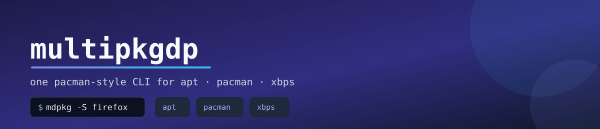

<p align="center">
  
</p>

<p align="center">
  <a href="https://github.com/DenisPth/mdpkg/actions/workflows/ci.yml"></a>
  <a href="https://github.com/DenisPth/mdpkg/releases/latest"></a>
  <a href="LICENSE"></a>
  
</p>

# multipkgdp — Multi-Backend Package Manager / Мультипакетный менеджер

**multipkgdp** — это универсальный CLI‑пакетный менеджер для Linux, который умеет работать с разными backend'ами: `apt` (Debian/Ubuntu), `pacman` (Arch), `xbps` (Void) и потенциально другими.  
Он даёт единый интерфейс команд (`install`, `remove`, `update`, `search`, `list`) независимо от дистрибутива.

---

## 🇬🇧 English

**multipkgdp** is a multi‑backend package manager for Linux written in Rust.  
It provides a unified CLI over system package managers such as:

- `apt` (Debian, Ubuntu)  
- `pacman` (Arch Linux)  
- `xbps` (Void Linux)  
- `flatpak` (any distro, via Flathub)

### Features

- Auto‑detect OS and choose backend (`apt`, `pacman`, `xbps`).  
- Manual backend override with `--backend` (must come before the operation).  
- pacman‑style commands: `-S`, `-R...`, `-Ss`, `-Syu`, `-Q`.  
- Shows OS info and the backend in use on `install`/`remove`/`update`.
- `-Ss <query>` with no explicit `--backend` searches **every** installed
  backend at once (apt/pacman/xbps/flatpak) and prints each result set under
  a `==> backend` header — pass `--backend` to search just one.
- `--generate-completions <bash|zsh|fish|elvish|powershell>` prints a shell
  completion script to stdout.
- `-R<flags>` forwards the suffix to the backend: exact pass‑through on `pacman`
  (e.g. `-Rns` → `pacman -Rns`); on `apt`, `n` maps to `purge` and `s` triggers
  an extra `autoremove` pass; `xbps` always does a recursive removal regardless
  of the suffix.
- `--backend flatpak`: a truly distro‑independent backend on top of Flathub —
  works the same on Arch, Debian, Fedora, Void, wherever `flatpak` is
  installed. Adds the Flathub remote automatically.
- `--backend <apt|pacman|xbps> --container`: runs that backend inside a
  [distrobox](https://github.com/89luca89/distrobox) container instead of the
  host, so you can install packages from a *different* distro's package
  manager (e.g. `xbps` packages on Arch, or `pacman` packages on Debian)
  without touching the host system. The container (`mdpkg-<backend>`) is
  created automatically on first use; override its base image per backend via
  `container_images` in `multipkgdp.yml` (see Configuration below). Requires
  `distrobox` and a container engine (`podman` or `docker`) to be installed.

### Configuration

Optional `multipkgdp.yml` (searched in `.`, `$XDG_CONFIG_HOME` /
`~/.config`, then `/etc`):

```yaml
backend: pacman            # default backend override
container_images:          # base image used by --container, per backend
  xbps: ghcr.io/void-linux/void-glibc-busybox:latest
  apt: debian:stable
  pacman: archlinux:latest
```

### Installation

Prebuilt binaries: grab the latest `.tar.gz` from the [Releases page](https://github.com/DenisPth/mdpkg/releases/latest), extract it, and put `multipkgdp` (plus the `mdpkg`/`mpdpg` symlinks) on your `PATH`.

From source:

```bash
git clone https://github.com/DenisPth/mdpkg.git
cd mdpkg
./install.sh                # builds a release binary and installs it,
                             # plus `mdpkg`/`mpdpg` symlinks, into /usr/local/bin
```

### Usage

```bash
multipkgdp -S firefox neovim
multipkgdp -Rns firefox
multipkgdp -Syu
multipkgdp -Ss firefox
multipkgdp -Q
multipkgdp --backend pacman -S firefox
multipkgdp --backend flatpak -S org.videolan.VLC
multipkgdp --backend xbps --container -S firefox   # xbps package on a non-Void host
multipkgdp -Ss firefox                             # searches every installed backend
multipkgdp --generate-completions zsh > _multipkgdp
```

---

## 🇷🇺 Русский

**multipkgdp** — мультипакетный менеджер для Linux на Rust, который умеет работать с несколькими backend'ами:

- `apt` (Debian, Ubuntu)  
- `pacman` (Arch Linux)  
- `xbps` (Void Linux)  
- `flatpak` (любой дистрибутив, через Flathub)

### Возможности

- Автоопределение дистрибутива и выбор backend'а (`apt`, `pacman`, `xbps`).  
- Явное указание backend'а через `--backend` (должен стоять перед операцией).  
- Pacman-style команды: `-S`, `-R...`, `-Ss`, `-Syu`, `-Q`.  
- Вывод информации об ОС и используемом бэкенде при `install`/`remove`/`update`.
- `-Ss <query>` без явного `--backend` ищет сразу **во всех** установленных
  бэкендах (apt/pacman/xbps/flatpak) и печатает каждый результат под
  заголовком `==> backend` — укажи `--backend`, чтобы искать только в одном.
- `--generate-completions <bash|zsh|fish|elvish|powershell>` выводит скрипт
  автодополнения в stdout.
- `-R<флаги>` пробрасывается в бэкенд: на `pacman` — один в один (например
  `-Rns` → `pacman -Rns`); на `apt` — `n` превращается в `purge`, а `s`
  запускает дополнительный проход `autoremove`; `xbps` всегда делает
  рекурсивное удаление независимо от суффикса.
- `--backend flatpak` — по-настоящему дистро-независимый бэкенд поверх
  Flathub: работает одинаково на Arch, Debian, Fedora, Void — где угодно, где
  есть `flatpak`. Flathub-репозиторий добавляется автоматически.
- `--backend <apt|pacman|xbps> --container` — запускает этот бэкенд внутри
  [distrobox](https://github.com/89luca89/distrobox)-контейнера вместо хоста,
  так можно ставить пакеты *другого* дистрибутива (например `xbps`-пакеты на
  Arch, или `pacman`-пакеты на Debian), не трогая хостовую систему. Контейнер
  (`mdpkg-<backend>`) создаётся автоматически при первом использовании;
  образ можно переопределить через `container_images` в `multipkgdp.yml` (см.
  «Настройка» ниже). Нужны `distrobox` и контейнерный движок (`podman` или
  `docker`).

### Настройка

Необязательный `multipkgdp.yml` (ищется в `.`, `$XDG_CONFIG_HOME` /
`~/.config`, затем `/etc`):

```yaml
backend: pacman            # бэкенд по умолчанию
container_images:          # базовый образ для --container, по бэкендам
  xbps: ghcr.io/void-linux/void-glibc-busybox:latest
  apt: debian:stable
  pacman: archlinux:latest
```

### Установка

Готовые бинарники: скачай последний `.tar.gz` со [страницы релизов](https://github.com/DenisPth/mdpkg/releases/latest), распакуй и положи `multipkgdp` (и симлинки `mdpkg`/`mpdpg`) в `PATH`.

Из исходников:

```bash
git clone https://github.com/DenisPth/mdpkg.git
cd mdpkg
./install.sh                # соберёт release-бинарник и поставит его,
                             # а также симлинки `mdpkg`/`mpdpg`, в /usr/local/bin
```

### Использование

```bash
multipkgdp -S firefox neovim
multipkgdp -Rns firefox
multipkgdp -Syu
multipkgdp -Ss firefox
multipkgdp -Q
multipkgdp --backend pacman -S firefox
multipkgdp --backend flatpak -S org.videolan.VLC
multipkgdp --backend xbps --container -S firefox   # xbps-пакет не на Void
multipkgdp -Ss firefox                             # ищет во всех установленных бэкендах
multipkgdp --generate-completions zsh > _multipkgdp
```

---

## 🇺🇸 Short card (for GitHub)

`multipkgdp` is a Rust-written multi-backend package manager for Linux (apt, pacman, xbps, etc.) with a unified CLI, OS auto‑detection and backend choice.

This is the foundation for `mdpkg` project under `DenisPth` on GitHub.

---

## License

MIT — see [LICENSE](LICENSE).
